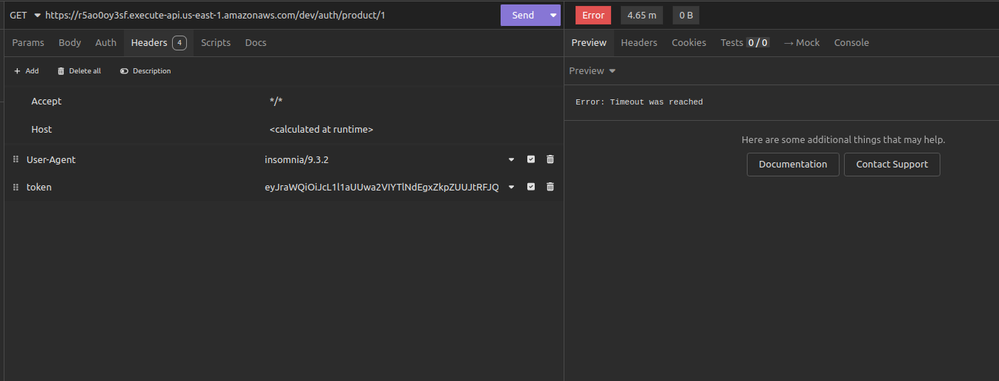
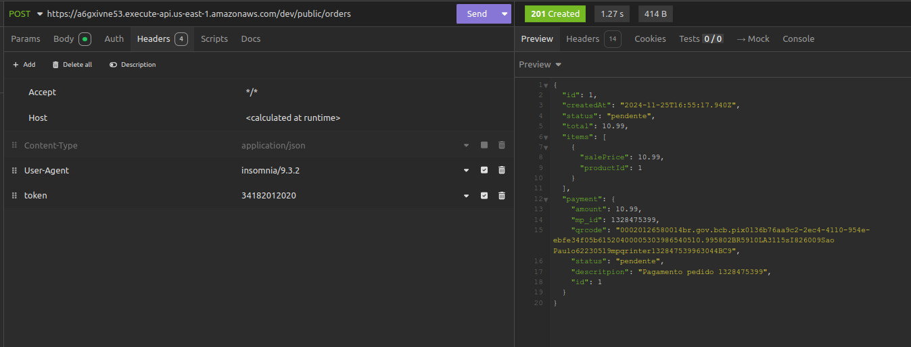

# fiap_03-s3

SUBIR APLICAÇÃO PARA GRAVAR

1- CRIAR S3
```
terraform init
terraform apply -auto-approve

```

2- RDS
 - Alterar credenciais no secrets do git hub
 - Executar github, pode iniciar pela interface ou commitar algo na main

3 - K8S

 - Alterar credenciais no secrets do git hub
 - Executar github, pode iniciar pela interface ou commitar algo na main

4 - APLICAÇÃO
 - Alterar credenciais no secrets do git hub
 - Alterar algo na master e filmar a esteira em execução

5 - LAMBDA
 - Alterar credenciais no secrets do git hub
 - Alterar url do loadbalancer

6 - FAZER OS TESTES 
 - Pegue a url gerada pelo api gateway
 - Para gerar secrets para os endpoints /auth
 ```
 aws cognito-idp initiate-auth \
  --auth-flow USER_PASSWORD_AUTH \
  --client-id <CLIENT_ID> \
  --auth-parameters USERNAME=34182012020,PASSWORD=12345678!
```
 
- Para gerar pedido
/public/orders, passar header token, mesmo que seja com '.'

 